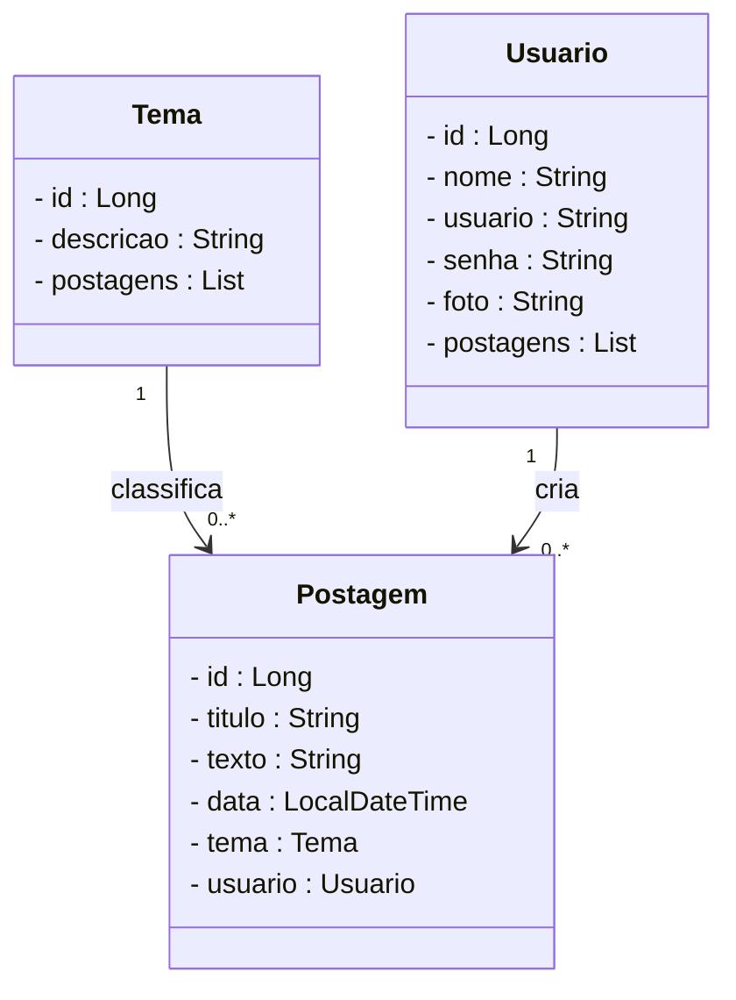
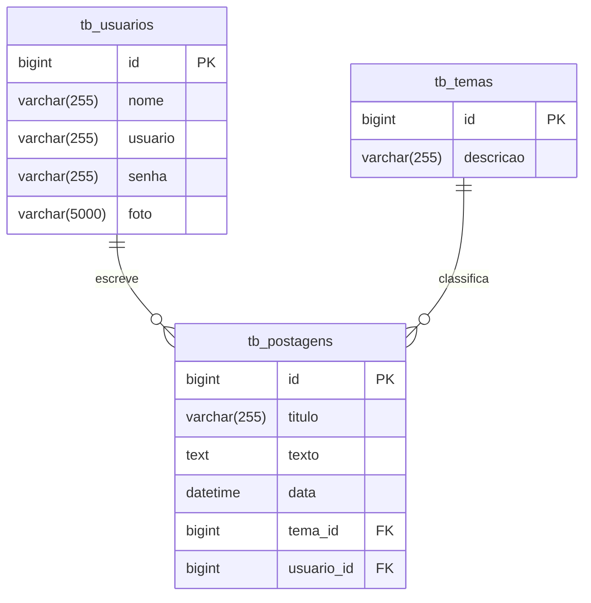

# Projeto Blog Pessoal - Backend com Spring Boot

 

     

 

  
  
  
  
  
  
  

 

## 1. Descrição

 

O **Blog Pessoal** é uma aplicação que permite que usuários publiquem, editem e visualizem postagens relacionadas a temas variados, de forma organizada e segura. Este projeto foi desenvolvido com fins educacionais, simulando uma aplicação real de blog para praticar conceitos de API REST com Java e Spring Boot.

Entre os principais recursos que um blog pessoal oferece, destacam-se:

1. Criação, edição e exclusão de postagens
2. Associação de postagens a temas específicos
3. Cadastro e autenticação de usuários
4. Visualização de postagens por tema ou usuário
5. Controle de acesso a operações sensíveis

 

## 2. Sobre esta API

 

A API do Blog Pessoal foi desenvolvida utilizando **Java** e o **framework Spring**, seguindo os princípios da Arquitetura MVC e REST. Ela oferece endpoints para o gerenciamento dos recursos **Usuário**, **Postagem** e **Tema**, permitindo a interação entre os usuários e os conteúdos publicados.

 

### 2.1. Principais funcionalidades da API:

 

1. Consulta, cadastro, login e atualização dos dados de usuários
2. Consulta, criação e gerenciamento de temas para classificar postagens
3. Criação, edição, listagem e remoção de postagens
4. Associação de postagens a temas e autores
5. Autenticação via token JWT para segurança nas requisições

 

## 3. Diagrama de Classes

 

O **Diagrama de Classes** é um modelo visual usado na programação orientada a objetos para representar a estrutura de um sistema. Ele exibe classes, atributos, métodos e os relacionamentos entre elas, como associações, heranças e dependências.

Esse diagrama ajuda a planejar e entender a arquitetura do sistema, mostrando como as entidades interagem e se conectam. É amplamente utilizado nas fases de design e documentação de projetos.

 

 

## 4. Diagrama Entidade-Relacionamento (DER)

 

O **DER (Diagrama Entidade-Relacionamento)** do projeto **Blog Pessoal** representa de forma visual como os dados estão organizados no banco de dados relacional e como as entidades se relacionam entre si.

 

 

## 5. Tecnologias utilizadas

 

| Item                          | Descrição       |
| ----------------------------- | --------------- |
| **Servidor**                  | Tomcat          |
| **Linguagem de programação**  | Java            |
| **Framework**                 | Spring Boot     |
| **ORM**                       | JPA + Hibernate |
| **Banco de dados Relacional** | MySQL           |
| **Segurança**                 | Spring Security |
| **Autenticação**              | JWT             |
| **Testes automatizados**      | JUnit           |
| **Documentação**              | SpringDoc       |

 

## 6. Requisitos

 

Para executar os códigos localmente, você precisará:

- [Java JDK 17+](https://www.oracle.com/java/technologies/javase/jdk17-archive-downloads.html)
- Banco de dados [MySQL](https://dev.mysql.com/downloads/)
- [STS](https://spring.io/tools)
- [Insomnia](https://insomnia.rest/download) ou [Postman](https://www.postman.com/)

 